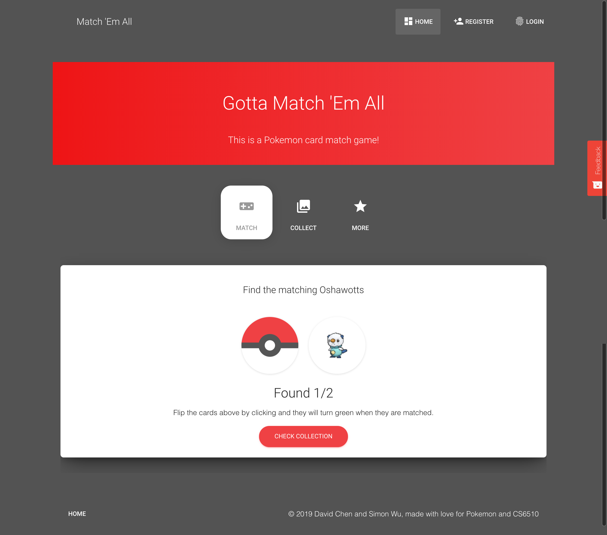
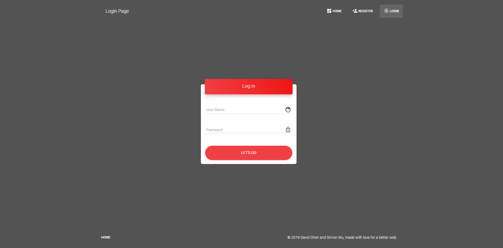
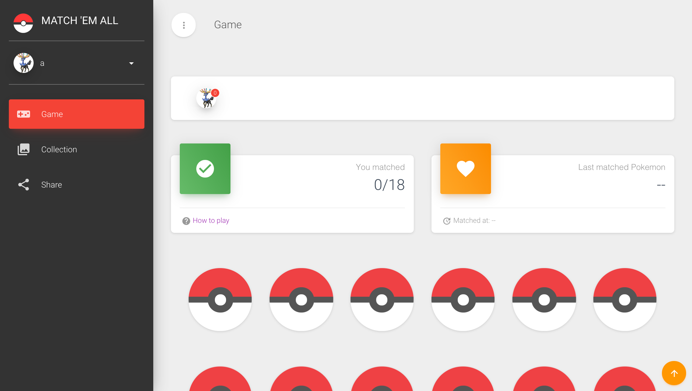
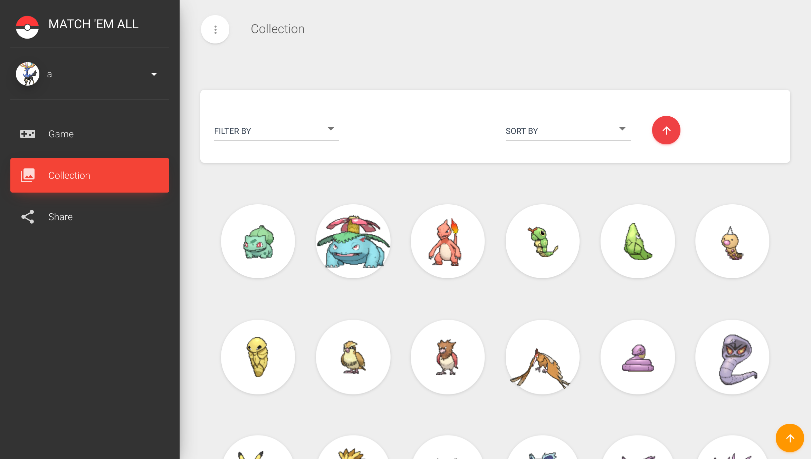
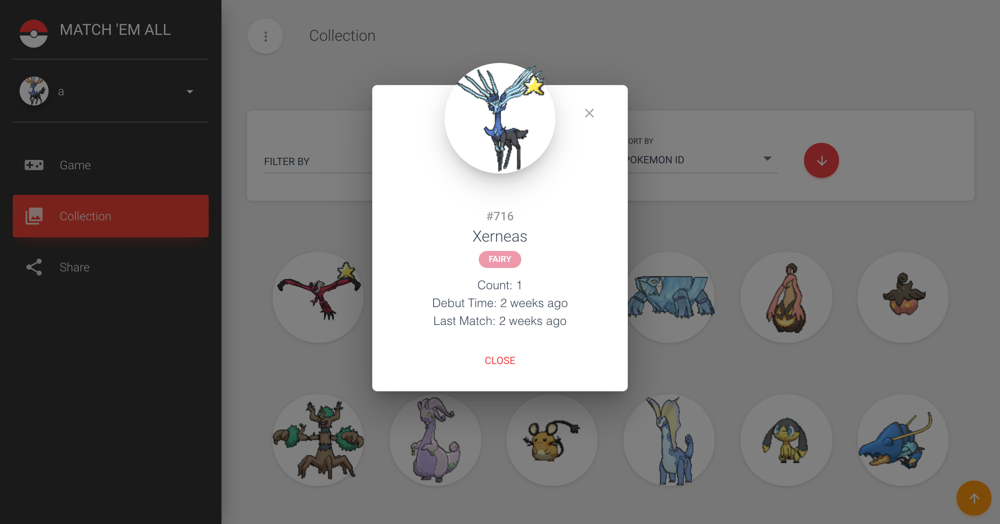
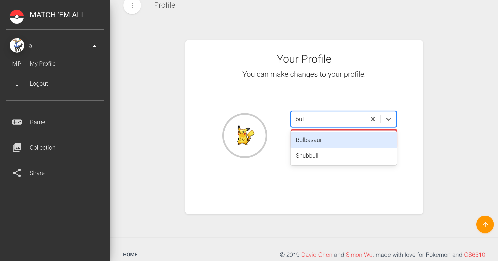
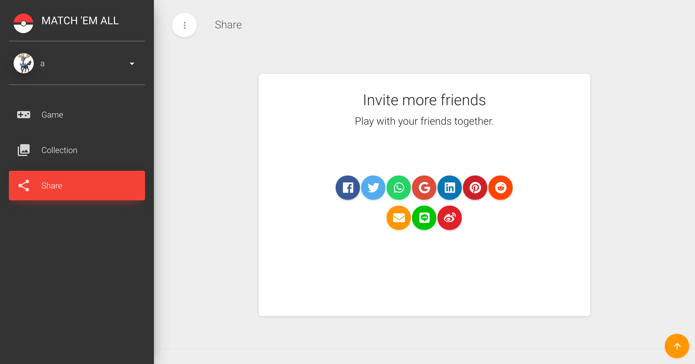

# Gotta Match 'Em All

> A flipping pokemon card game. When you flip two same card, you catch the pokemon! Compete with others and expand your collection! Try to Catch some rare pokemons like Groudon! 

[](https://github.com/davidychen/match-em-all/blob/master/LICENSE)
[](https://github.com/davidychen/match-em-all/commits/master)
[](https://github.com/davidychen/match-em-all/network/members)
[](https://github.com/davidychen/match-em-all/stargazers)

## Getting Started

Follow the below steps and you will get the app run locally

### Prerequisites
[Node](https://nodejs.org/)
[Meteor](https://www.meteor.com/)

### Installing

Clone the repo, then open the terminal on the folder created

```sh
git clone https://github.com/davidychen/match-em-all.git
cd match-em-all
meteor npm install
```

### Run

```sh
meteor reset
meteor
```

Which will run the front-end development server on the port 3000, then visit (http://localhost:3000) and you should see the app running. The database is running on port 3001.

## Database

You can either use a local meteor database or a cloud database. If you need to use a cloud database, Just set your database url as variable MONGO_URL in .env as an environment variable. It has 2 collections: pokemon, collections. We are using the heroku add-on database.

## Deployment

Deployment is using heroku. The link is here: <https://match-em-all.herokuapp.com/>.

## Style

### Screenshots








### Demonstration Video
[Youtube match em all](https://youtu.be/KXSKQ-x-RoY)

### Usability Report
[Report](docs/README.md)

### Color Palette (Analogous)
-  `#9c27b0`
-  `#ff9800`
-  `#f44336`
-  `#4caf50`
-  `#00acc1`

### Font Pairing
- Roboto (headings)
- Open Sans (paragraphs)

## Authors
* [**Yifei Chen**](https://www.davidychen.com/)
* [**Shuomin Wu**](https://simonwux.github.io/)

## License

This project is licensed under the MIT License - see the [LICENSE](LICENSE) file for details

## Contributing

1. Fork it (<https://github.com/davidychen/match-em-all>)
2. Create your feature branch (`git checkout -b feature/fooBar`)
3. Commit your changes (`git commit -am 'Add some fooBar'`)
4. Push to the branch (`git push origin feature/fooBar`)
5. Create a new Pull Request

## Class Link
[CS-5610 Web Development Spring 2019](http://johnguerra.co/classes/webDevelopment_spring_2019/)

