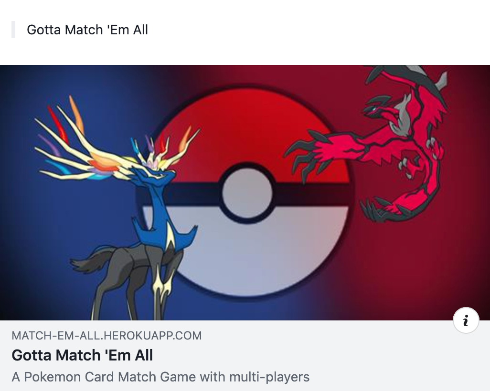
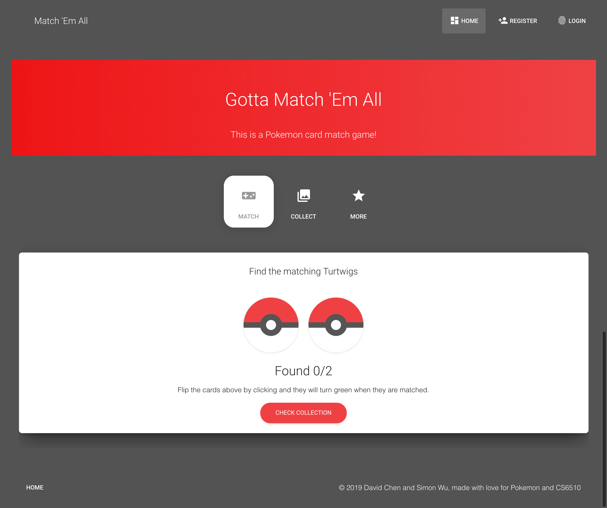

# Gotta Match 'Em All Usability Full Report

> April 23, 2019

## Table of Content

* [Overview & Top Findings](#Overview--Top-Findings)
* [Project Methodology](#Project-Methodology)
* [User Profile](#User-Profile)
* [Usability Findings & Recommendations](#Usability-Findings--Recommendations)
* [Final Questions](#Final-Questions)

---

## Overview & Top Findings

The goal of this research effort was to assess to overall usability of the <https://match-em-all.herokuapp.com> website while it is still in development. To meet this goal, a usability study was conducted of the current website design.

### Top Findings

* **Pikachu**

   Pikachu! pikachu!

* **Brainwash**

   Finally a game to play after Pokemon Go if you really like pokemons

---

## Project Methodology

**Two** users were invited to participate in a usability study of the <https://match-em-all.herokuapp.com> web site. During the test session, users were asked to perform several tasks including signing up to become a member, matching pokemons, checking collections, and sharing to social media. Users’ errors, comments, and satisfaction ratings were observed and recorded during the study. 

---

## User Profile

The participants were all non-technical people. 

User # | Sex / Age | Job Title / Company |  Platform / Browser | Prepared By
--- | --- | --- | --- | ---
1 | M / 24 | Student | Mac / Chrome | David
2 | F / 24 | Student | Mac / Chrome | David

---

## Usability Findings & Recommendations

### Home Page Issues

#### 1. Web Site Visitation

  

After looking at this sharing post, users were asked to predict whether they would visit the web site. Users’ responses are summarized in the table below. 

User | Would you visit the website? | User Comments
--- | --- | ---
1 | Yes | Like the picture and wonder if violate the copyright
2 | Yes | Pretty fancy

#### 2. First Clicks from Home

  

Users were next asked to look at the home page and comment on which links they would click. Most users would have visited the "What is Match 'Em All?" page as well as the Online Demo.

User | First Links Selected
--- | ---
1 | left Pokemon ball
2 | Match tab - right Pokemon ball

#### 3. Would You Sign Up?

After exploring the home page, users were asked if they would sign up to play the game. If users hesitated, they were asked what additional information they would need to see before joining.

User | Would you sign up? | Information Wanted Prior to Signing Up
--- | --- | --- 
1 | Yes | Add feature - forget password
2 | Yes | Register and Login doesn't look like a game

#### 4. About the Game

Based on what you see on the game page, what are your expectations for using this site?

User | Confusing (0)   Clear (10) | Difficult to Use (0)   Easy to Use (10) | Comment 
--- | --- | --- | ---
1 | 9 | 9 | Too simple usage of the game
2 | 10 | 10 | Looks much better on mobile devices, pokemon balls are too big on desktop
**Mean** | **10** | **10** | **--**

#### 5. About the Collection

Based on what you see on the collection page, what are your expectations for using this page?

User | Hard to find (0)   Easy to find (10) | Bad display (0)   Clear display (10) | Comment 
--- | --- | --- | ---
1 | 8 | 1 | Add search to collection, Add base stats to display
2 | 3 | 8 | Display card too wide on desktop
**Mean** | **8** | **1** | **--**

---

## Final Questions

1. **Rate your overall impression of the web site you used today:**

User | Overall | Difficult to Use (0)   Easy to Use (10) | Boring (0)   Exciting (10) | Comment 
--- | --- |--- | --- | ---
1 | 9 | 9 | 5 | Need more hard work
2 | 9 | 9 | 9 | -- 
**Mean** | **3** | **3** | **--**

2. **Rate the instructions located throughout the site:**

User |  Unhelpful (0)   Helpful (10) | Comment 
--- | --- | --- 
1 | 10 | --
2 | 8 | Game itself is straightforward, Title takes too much attention, then instruction lose important
**Mean** | **3** | **--**

3. **Rate your agreement with the following statement.**

I always knew exactly where I was in the web site and how to get to where I was going.

User |  Strongly Disagree (0)   Strongly Agree (10) | Comment   (where did you feel lost?) 
--- | --- | --- 
1 | 10 | --
2 | 10 | --
**Mean** | **3** | **--**

4. **Do you still have any unanswered questions about how the game works at this point?**

User | Comment
--- | --- 
1 | No
2 | No

5. **After this brief introduction to the game, would you be interested in playing?**

User |  Response | Comments
--- | --- | --- 
1 | Yes | --
2 | Yes | Not exciting game but very addictive

